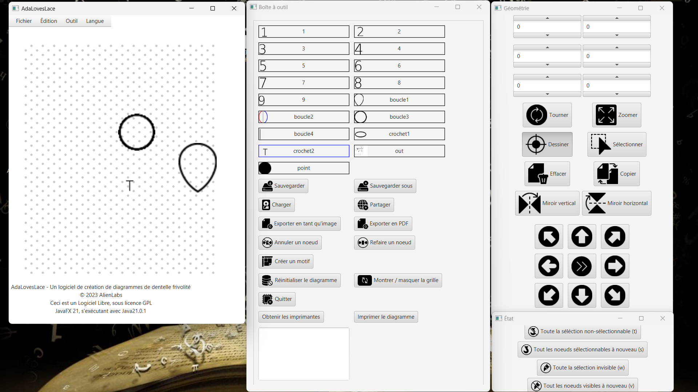
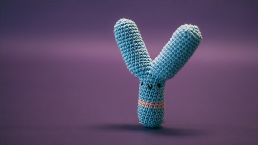

<link rel="stylesheet" href="assets/css/modest.css">
<link rel="shortcut icon" type="image/x-icon" href="favicon.ico">

Ada Aime la Dentelle : un logiciel de création de diagrammes de dentelle

AdaLovesLace: A tatting lace patterns creation software

### [Téléchargements / downloads](telechargements.md)

### [Documentation](documentation.md)

### [Partage de diagrammes / diagram sharing](https://dentelle.damemarieantoinette.art/)

Ceci est un Logiciel Libre, sous les termes de la [licence Affero GPL V3](licence.md) 

This is Free Software, under [Affero GPL V3 license](licence.md)

© 2023-2025 Zala GOUPIL

Ce logiciel vient SANS ABSOLUMENT AUCUNES GARANTIES, autres que celles que la loi exige.

This software comes with ABSOLUTELY NO GUARANTEE, to the extent permitted by applicable law.